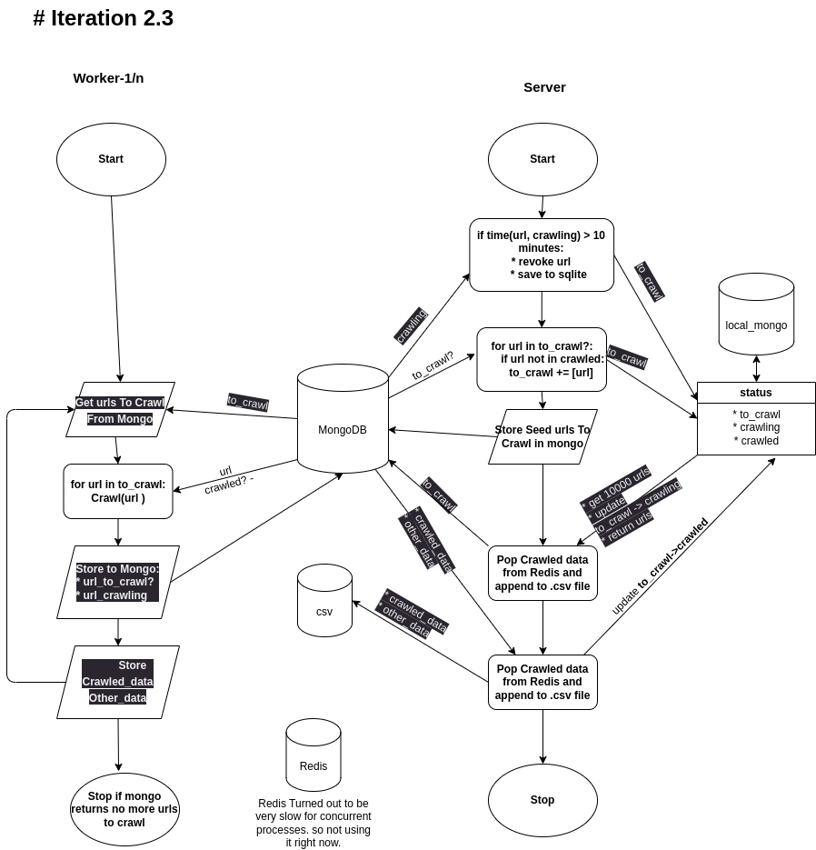

# Distributed Scrapy script to crawl online nepali news sites
### workflow (img)


* Worker: Distributed Scrapy Script that performs the actual crawling
* Server: Central Scrpit that collects the crawled data


### Save mongo-db api key and redis api key in file: server/.env
format:
```

# get them from: https://cloud.mongodb.com/
mongo_username="<username>"
mongo_password="<password>"

# get them from: https://app.redislabs.com/ -> create new database
REDIS_PASSWORD="<redis-password>"
REDIS_PORT='<redis-port>'
REDIS_HOST='<redis-host>'

```

## Test run the scrapy-engine
`scrapy crawl worker_spider_v2 -o worker_spider_v2.json`

### To run the server
```
cd server
python3 server.py
```
* Redis: to get crawled data
* MongoDb: to store urls working with
* generates two .csv files: crawled_data.csv, other_data.csv

## Re-initialize Database
* note:It will delete everything in MongoDb, Redis and .csv files

  ### Mongo
  ```
  # Convert all urls with status: crawled -> to_crawl
  from mongo import Mongo
  db=Mongo()
  db.recover_expired_crawling(0)


  ## Delete all (does-not require re-indexing)
  db.collection.delete_many({})
  crawled_data = list(db.db['crawled_data'].find())
  other_data = list(db.db['other_data'].find())
  combined_data = {"crawled_data":crawled_data, "other_data":other_data}
  
  # Delete multiple data by id
  db.db['crawled_data'].delete_many({"_id": {"$in": [data['_id'] for data in crawled_data]} })
  db.db['other_data'].delete_many({"_id": {"$in": [data_ot['_id'] for data_ot in other_data]} })
  
  # Create index for unique url
  db.collection.create_index('url', unique=True)

  # Populate initial Start Urls
  import time
  from mongo_db_handler import MongoDBHandler
  db_handler = MongoDBHandler(collection_name="scrapy-engine", db_name="scrapy-engine")
  start_urls = ["https://onlinemajdoor.com/", "http://nepalipost.com/beta/", "https://nepalkhabar.com/", "https://www.nepalipaisa.com/", "https://topnepalnews.com/",  "https://www.dainiknepal.com/", "https://www.bbc.com/nepali"]
  db_handler.insert_many([{'url':url, 'timestamp':time.time(), 'status':'to_crawl'} for url in start_urls], collection_name='urls-collection')

  ```

  ### Redis
  ```
  from dotenv import load_dotenv
  load_dotenv()

  import redis
  import os

  redis_client = redis.Redis(
              host=os.environ.get('REDIS_HOST', 'localhost'),
              port = int(os.environ.get('REDIS_PORT', 6379)),
              password=os.environ.get('REDIS_PASSWORD', None),
          )

  # delete all key-value pairs
  redis_client.flushall()

  # Get all keys from redis
  redis_client.keys()
  ```


  ### CSV Files
  ```
  # Remove crawled_data.csv
  !rm crawled_data.csv

  # Remove other_data.csv
  !rm other_data.csv
  ```


### load csv data
```
rows=[]
with open('nepali_dataset.csv', 'r') as csvfile:
  # Create a reader object
  csv_reader = csv.reader(csvfile)
  # Read the data row by row
  for row in csv_reader:
      # Do something with the data in each row
      rows.append(row)q
```

# Urls to crawl from
```
["https://kantipurtv.com/", "https://www.janaboli.com/", "https://ekagaj.com/", "https://www.nepalviews.com/", "https://hib.gov.np/", "https://butwalmun.gov.np/", "https://swasthyakhabar.com/", "https://hetaudamun.gov.np/", "https://hr.parliament.gov.np/", "https://www.immigration.gov.np/", "https://pppc.bagamati.gov.np/newsandnotices", "http://mahakalimundarchula.gov.np/taxonomy/term/110", "https://www.dor.gov.np/home/news", "https://np.usembassy.gov/ne/", "https://lawcommission.gov.np/np/", "https://sabailamun.gov.np/ne/", "https://daokathmandu.moha.gov.np/", "https://barjumun.gov.np/", "https://na.parliament.gov.np/", "https://panchkhalmun.gov.np/ne/news-notices", "https://moics.gov.np/", "https://www.dor.gov.np/"]

nepberta_urls = [ "https://ekantipur.com/",  "https://onlinekhabar.com/",  "https://nagariknews.com/",  "https://thahakhabar.com/",  "https://ratopati.com/",  "https://reportersnepal.com/",  "https://setopati.com/",  "https://hamrakura.com/",  "https://lokpath.com/",  "https://abhiyandaily.com/",  "https://pahilopost.com/",  "https://lokaantar.com/",  "https://dcnepal.com/",  "https://nayapage.com/",  "https://nayapatrikadaily.com/",  "https://everestdainik.com/",  "https://imagekhabar.com/",  "https://shilapatra.com/",  "https://khabarhub.com/",  "https://baahrakhari.com/",  "https://ujyaaloonline.com/",  "https://nepalkhabar.com/",  "https://emountaintv.com/",  "https://kathmandupress.com/",  "https://farakdhar.com/",  "https://kendrabindu.com/",  "https://dhangadhikhabar.com/",  "https://gorkhapatraonline.com/",  "https://nepalpress.com/",  "https://hamrokhelkud.com/",  "https://himalkhabar.com/",  "https://nepallive.com/",  "https://nepalsamaya.com/",  "https://kalakarmi.com/",  "https://dainiknewsnepal.com/", "https://www.newsofnepal.com", "https://deshsanchar.com/"]


'''
* 'dainikonline' seems to have been closed or moved somewhere else.
* latest tweets in their twitter page are from 2019. https://twitter.com/dainikonline2?lang=en
'''
nepberta_error_urls  = ["https://dainikonline.com/"]    
new_urls = []

crawling_completed = ['https://www.hamrakura.com/',  'https://www.bigulnews.com/', 'https://www.baahrakhari.com/',  'https://www.ekantipur.com/',  'https://sancharkendra.com/',  'https://www.realkhabar.net/',  'https://www.nagariknetwork.com/',  'https://www.abhiyandaily.com/',  'https://www.eadarsha.com/',  'https://samacharpati.com/',  'https://www.hamrokhotang.com/',  'https://www.aarthiknews.com_merged_/',  'https://www.kantipath.com/',  'https://www.onlinetvnepal.com/',  'https://www.eadarshhistora.com_merged_/',  'https://www.arghakhanchi.com/',  'https://www.nayapage.com/',  'https://www.radiosagarmatha.org.np/',  'https://www.onsnews.com/',  'https://www.onlinekhabar.com_merged_/',  'https://www.saptahik.com.np/',  'https://www.sancharkendra.com_merged_/',  'https://www.samacharpati.com_merged_/',  'https://www.nepalihimal.com/',  'https://aarthiknews.com/']


have_crawled_incomplete = ["https://hamrakura.com/", "https://onlinekhabar.com/"]


need_special_attention = ["https://www.bbc.com/nepali", "https://beta.gorkhapatraonline.com/epapermaincategory", "https://epaper.gorkhapatraonline.com/", "https://ujyaaloonline.com/" -> 403 response by cloudfare]
'''
[X] bbc_nepali: avoid following links that does not start with: bbc.com/nepali
gorkhapatra: it would be nice to crawl pdfs of gorkhapatra
            problem is: I coudn't find their encoding scheme
'''


```

# Post-Process
* `python3 post_process.py`
* to extract nepali paragraphs in csv format from crawled `.json` data.

```
from scrapy_engine.spiders.functions import merge_same_named_json_files
merge_same_named_json_files(delete_merged=True)
```


# How to know if crawling is completed for urls?
* command: `pytho3 resume_incomplete_crawling.py`
* get resume_urls from crawled data if any
* and resume crawling

# Data:
* [data-crawled-so-far](https://drive.google.com/drive/folders/1v_dv0H56D3J-56VDPIaBkJ601djs8C0w?usp=sharing)
